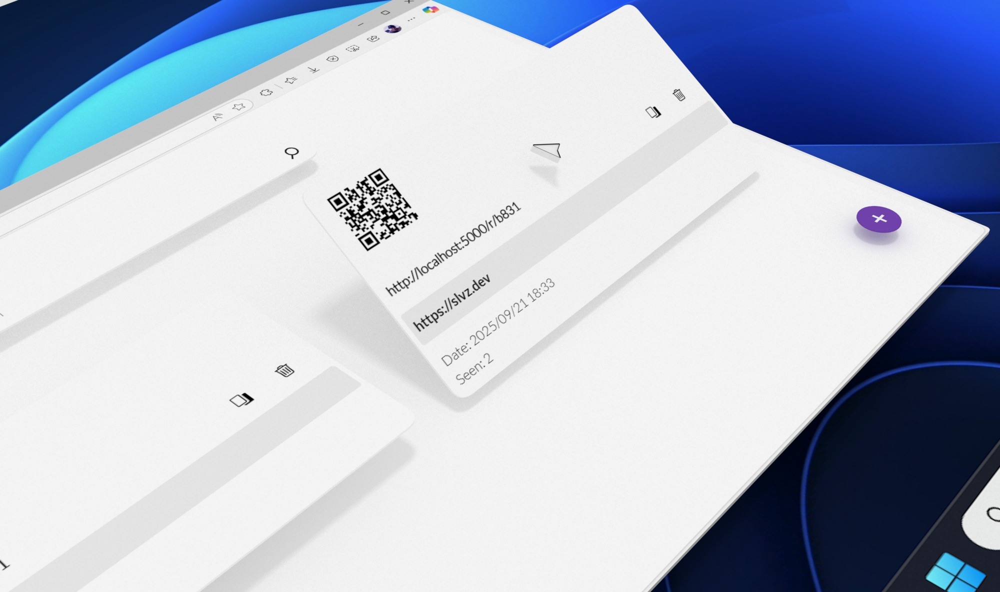

# LinkCutter 🔗✂️

**Link Cutter** is a simple and powerful **Blazor Server** application built with **.NET 9** that allows you to create short links from long URLs — and track their usage.  
Each time someone clicks on a shortened link, the system automatically counts the view so you can see how many times it has been accessed.



---

## ✨ Features

- **Create short links** from long URLs easily  
- **QR Code generator** for each shortened link  
- **Search functionality** to find your links quickly  
- **View statistics**: track how many times each link was visited  
- **Open Source Database Option**:  
  - Currently using [SLVZDB](https://github.com/slvz2556/SLVZDB) (custom lightweight database)  
  - Can be easily migrated to SQL Server  

---

## 🚀 Getting Started

### Prerequisites
- [.NET 9 SDK](https://dotnet.microsoft.com/download)
- (Optional) SQL Server if you want to use it instead of SLVZDB


### Installation


1. **Clone the repository**
   ```bash
   git clone https://github.com/slvz2556/LinkCutter.git
   cd LinkCutter


2. **Run the project**
  ```bash
  dotnet run


```

3. **Open your browser and navigate to**
  ```bash
  https://localhost:5000

```

### Tech Stack

- Frontend: Blazor Server
- Backend: .NET 9
- Database: SLVZDB (custom) / SQL Server
- Other: QR Code generation, Search indexing


### License
This project is licensed under the MIT License.
